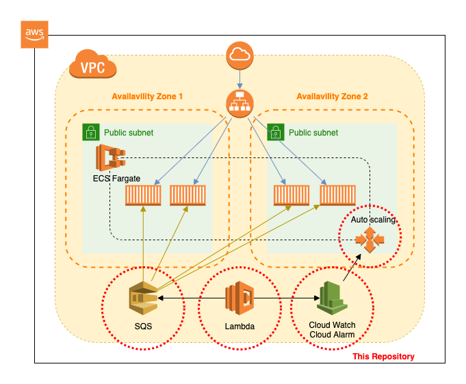

# SQS based AWS Fargate Autoscaling

This repository defines terraform scripts and aws fargate task definition.  
This repository just define the minimum resources, so to deploy into the production, you will need to add some resources.

# Setup 

- [Terraform](environment/README.md)
- [Fargate](fargate/README.md)

# Diagram

